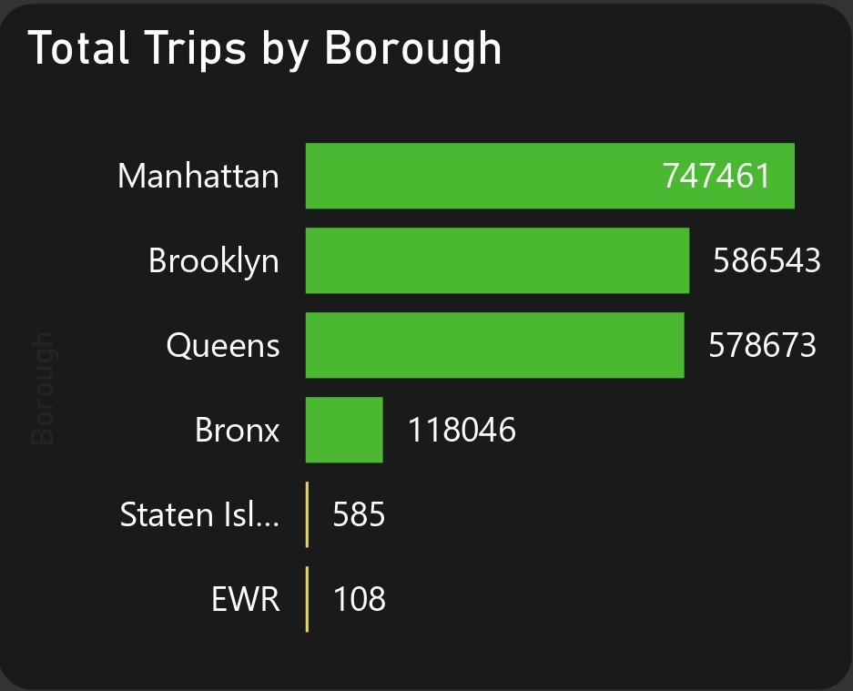
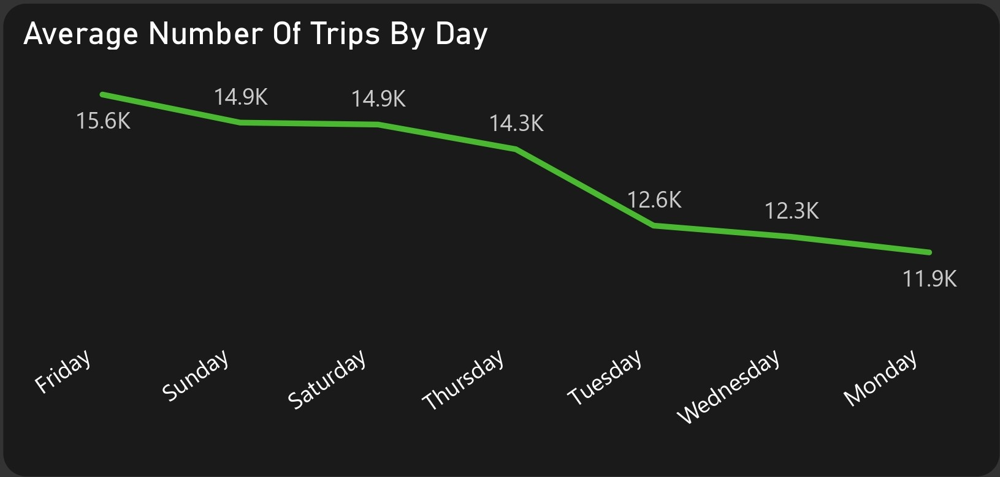

# New York City Taxi Trips (2017-2018) Analysis

## Project Overview

### Introduction:
The "New York Taxi Trips (2017-2018) Analysis" project aims to explore and analyze taxi trip data from New York City spanning the years (Jan) 2017 and (April 28 - June 8) 2018. New York City's taxi services are a vital component of its transportation system, and analyzing trip data provides valuable insights into travel patterns, demand trends, and other factors influencing transportation dynamics within the city.

For this project, you’ll be playing the role of a new Data Analyst for the New York City Taxi & Limousine Commission. It's your first week on the job, and you just received the following email from the Lead Dispatcher:

Welcome to the team!

This a Project Analysis and Visualization challenge!

We’ve been collecting trip data for specific months in 2017 and 2018, but without a proper analyst we haven’t been able to put it to good use. That's where you come in!

### Objectives:
The raw data has some issues, so we'll need to make the following adjustments and assumptions to clean and prep the data:
- Let’s stick to trips that were NOT sent via “store and forward”
- I’m only interested in street-hailed trips paid by card or cash, with a standard rate
- We can remove any trips with dates before 2017 or after 2018, along with any trips with pickups or drop-offs into unknown zones
- Let’s assume any trips with no recorded passengers had 1 passenger
- If a pickup date/time is AFTER the drop-off date/time, let’s swap them
- We can remove trips lasting longer than a day, and any trips which show both a distance and fare amount of 0
- If you notice any records where the fare, taxes, and surcharges are ALL negative, please make them positive
- For any trips that have a fare amount but have a trip distance of 0, calculate the distance this way: (Fare amount - 2.5) / 2.5
- For any trips that have a trip distance but have a fare amount of 0, calculate the fare amount this way: 2.5 + (trip distance x 2.5)

Once the data is cleaned up, I’m hoping you can build me a dashboard to help with weekly planning and logistics. For any given fiscal week, I'd like to be able to use historical data to answer the following questions:

1. What's the average number of trips we can expect this week?
2. What's the average fare per trip we expect to collect?
3. What's the average distance traveled per trip?
4. How do we expect trip volume to change, relative to last week?
5. Which days of the week and times of the day will be busiest?
6. What will likely be the most popular pick-up and drop-off locations?

Generate your own insights to add to this!

And of course i added more questions to the objective:

7. What is the Total Revenue in this analysis?                                                                                                            
8. What is the Taxi Trip Trend and Revenue Trend for (Jan) 2017?                                                                                
9. What is the Taxi Trip Trend and Revenue Trend for (April 28 - June 8) 2018?                                                                               
10. What is the total trips by Vendor?                                                                                                                               
11. What is the total trips by payment type?                                                                                                                 
12. What is the total trips by borough?                                                                                                                          
13. Where are the Top 6 Trips zones?                                                                                                                                
14. What is the number of trips by the days of the week?                                                                                        
15. What is the number of trips by the time of the day?   

I realize this is a lot to ask for, but this type of analysis will have a huge impact on our business!
Thanks in advance,

For this challenge, your task is to build a dashboard that meets the requirements.

### Expected Outcomes: 
- __Average Number of Trips:__ By cleaning and preprocessing the data according to the specified criteria, i will provide an accurate estimate of the average number of taxi trips expected for each fiscal week. 
- __Average Fare per Trip:__ Adjusting fare amounts based on provided rules and filtering for street-hailed trips paid by card or cash, i will calculate the average fare per trip. 
- __Average Distance Traveled per Trip:__ Through data cleaning and adjustment of trip distance based on specified rules, i will compute the average distance traveled per trip.
- __Expected Trip Volume Change Relative to Last Week:__ Leveraging historical data, statistical analysis, and trend forecasting techniques, i will predict the expected change in trip volume relative to the previous week. 
- __Busiest Days and Times of the Week:__ Utilizing historical trip data, i will identify patterns to determine the busiest days and times of the week for taxi services. 
- __Most Popular Pick-up and Drop-off Locations:__ Employing a deep analysis techniques on cleaned data, i will identify the most popular pick-up and drop-off locations during each fiscal week. 
- __Total Revenue Analysis:__ Summing up the fare amounts for all trips within the analyzed period to calculate the total revenue generated from taxi services. 
- __Taxi Trip and Revenue Trends for (Jan) 2017:__ Analyzing trip volume and revenue trends over the course of (Jan) 2017 to identify patterns, seasonality, and growth trends. 
- __Taxi Trip and Revenue Trends for (April 28- June 8) 2018:__ Similar to the analysis for 2017, examining trip volume and revenue trends for between April 28 to June 8, 2018 to identify any shifts or changes in demand patterns. 
- __Total Trips by Vendor:__ I will aggregate trip counts based on the vendor or taxi company to assess their respective market share and performance. 
- __Total Trips by Payment Type:__ I will categorize trip counts based on payment methods such as cash or card to understand customer preferences and payment trends. 
- __Total Trips by Borough:__ I will Segment trip counts based on boroughs or geographic regions to identify areas of high demand and distribution patterns. 
- __Top 6 Trip Zones:__ I will Identify the top six zones with the highest trip volumes to prioritize service coverage and marketing efforts. 
- __Number of Trips by Day of the Week:__ I will analyze trip counts by day of the week to identify trends and fluctuations in demand throughout the week. 
- __Number of Trips by Time of the Day:__ I will segment trip counts by time intervals throughout the day to understand peak hours and periods of high demand. 

### Dataset Overview
This dataset contains 6 tables in csv format, along with a geospatial map in TopoJSON and Shapefile formats
- The 2 Taxi Trips tables contain a total of 2,095,552 million Green Taxi trips in New York City for (Jan) 2017 and (April 28 - June 8) 2018. Each record represents one trip, with fields containing details about the pick-up/drop-off times and locations, distances, fares, passengers, and more.
-  The 454 Calendar table contains a fiscal calendar (2017-2020) used by the Taxi & Limousine Commission, with fields containing the date and fiscal year, quarter, month, 
and week.
- The Taxi Zones table contains information about 265 zone locations in New York City, including the location id, borough, and service zone.
- The Taxi Zones Map files contain a map of New York City with divisions for the 265 locations that can be used to create custom map visuals in Power BI (TopoJSON) or 
Tableau (Shapefile).

The 2 key tables that contains the taxi trips data are the 2017_taxi_trips.csv and 2018_taxi_trips.csv. Both contains same number columns and column names. With both table sizes over 200mb, it was too large to upload to github.

Below is a table that displays the data_dictionary which explians the column headers in the taxi trips data 2017 and 2018, and also displays and explains the taxi_zones and the 454_calender columns for a better understanding of this dataset:

| Table                    | Field                    | Description                            |            
|:------------------------ |:------------------------ |:-------------------------------------- |
|data_dictionary           |VendorID                  |A code indicating the LPEP provider that provided the record (1= Creative Mobile Technologies, LLC; 2= Verifone Inc.)|
|                          |lpep_pickup_datetime      |The date and time when the meter was engaged          |
|                          |lpep_dropoff_datetim      |The date and time when the meter was disengaged        |
|                          |store_and_fwd_flag        |This flag indicates whether the trip record was held in vehicle memory before sending to the vendor, aka “store and forward,” because the vehicle did not have a connection to the server (Y= store and forward trip; N= not a store and forward trip)       |
|                          |RatecodeID                |The final rate code in effect at the end of the trip (1= Standard rate; 2= JFK; 3= Newark; 4= Nassau or Westchester; 5= Negotiated fare; 6= Group ride)       |
|                          |PULocationID              |TLC Taxi Zone in which the taximeter was engaged        |
|                          |DOLocationID              |TLC Taxi Zone in which the taximeter was disengaged       |
|                          |passenger_count           |The number of passengers in the vehicle (this is a driver entered value) |
|                          |trip_distance             |The elapsed trip distance in miles reported by the taximeter |
|                          |fare_amount               |The time-and-distance fare calculated by the meter |
|                          |extra                     |Miscellaneous extras and surcharges (this only includes the $0.50 and $1 rush hour and overnight charges) |
|                          |mta_tax                   |$0.50 MTA tax that is automatically triggered based on the metered rate in use |
|                          |tip_amount                |Tip amount (automatically populated for credit card tips - cash tips are not included)   |
|                          |tolls_amount              |Total amount of all tolls paid in trip           |
|                          |improvement_surcharge     |$0.30 improvement surcharge assessed on hailed trips at the flag drop    |
|                          |total_amount              |The total amount charged to passengers (does not include cash tips) |
|                          |payment_type              |A numeric code signifying how the passenger paid for the trip (1= Credit card; 2= Cash; 3= No charge; 4= Dispute; 5= Unknown; 6= Voided trip) |
|                          |trip_type                 |A code indicating whether the trip was a street-hail or a dispatch that is automatically assigned based on the metered rate in use but can be altered by the driver (1= Street-hail; 2= Dispatch) |
|                          |congestion_surcharge      |Congestion surcharge for trips that start, end or pass through the congestion zone in Manhattan, south of 96th street ($2.50 for non-shared trips in Yellow Taxis; $2.75 for non-shared trips in Green Taxis) |
|taxi_zones                |LocationID               |Unique identifier assigned to each specific location within the service zone       |
|                          |Borough                  |The borough (administrative division) of New York City where the location is situated   |
|                          |Zone                     |A specific geographical zone or area within the borough.    |
|                          |service_zone             |Denotes the service zone classification of the location, indicating whether it falls within New York City's defined service zones for taxi operations.    |
|454_calender              |Date                     |The calendar date of the recorded data entry  |
|                          |FiscalYear               |The fiscal year in which the date falls, typically representing the financial reporting year of the organization |
|                          |FiscalQuarter            |The fiscal quarter of the year in which the date falls|
|                          |FiscalMonthNumber        |The numerical representation of the fiscal month within the fiscal year|
|                          |FiscalMonthOfQuarter     |The ordinal representation of the fiscal month within the fiscal quarter|
|                          |FiscalWeekOfYear         |The week number within the fiscal year|
|                          |DayOfWeek                |The day of the week corresponding to the date (e.g., Monday, Tuesday, etc.)|
|                          |FiscalMonthName          |The name of the fiscal month (e.g., January, February, etc.)|
|                          |FiscalMonthYear          |The combination of the fiscal month and year|
|                          |FiscalQuarterYear        |The combination of the fiscal quarter and year|
|                          |DayOfMonthNumber         |The numerical representation of the day within the month|
|                          |DayName                  |The name of the day corresponding to the date (e.g., Monday, Tuesday, etc.)|

### Tools Used
1. Power Query Editor
    - Was used to:
        1. Extract,
        2. Transform, and
        3. Load all the datasets for this analysis.
           
2. Power BI (Was used to create reports and dashboard for this analysis)
    - The following Power BI Features were incorporated:
        1. DAX
        2. Quick Measures
        3. Page Navigation
        4. Filters
        5. Tooltips
        6. Button

### Data Cleaning, Transformation and Loading using the Power Query Editor:
1. Changed the columns data types in both the 2017_taxi_trips.csv table and the 2018_taxi_trips.csv to the right data types.
2. Sticked to the taxi trips that were not sent via __store and forward__ by removing all rows that has the value __"Y"__ in the data table rows of the __"store_and_fwd_flag"__ column in both the 2017 and 2018 tables.
3. Sticked only to the street-hailed trips paid for by __card__ or __cash__ with a standard rate by removing rows that doesn't have the text value __"card"__ or __"cash"__ in the __"payment_type_details"__ column of both tables.
4. Removed all trips with dates before __2017__ or after __2018__, along with any trips with pickup or drop-offs into unknown zones by removing rows of data from both tables that the __"ipep_pickup_datetime"__ and __"ipep_dropoff_datetime"__ does not fall into the year __2017__ and __2018__. Secondly, removed rows from both table where the __"PULocationID"__ and __"DOLocationID"__ columns have the values __264__ or __265__ which indicates unknown zones.
5. Assigned __1__ passenger to the __"passenger_count"__ column of both tables where the passsenger count row has null values or __0__.
6. Swapped all __"ipep_pickup_datetime"__ and __"ipep_dropoff_datetime"__ columns where a __pickup date/time__ is after the __drop-off date/time__.
7. Removed rows from both table where the __"fare_amount"__ column data equals __0__ and the __"trip_distance"__ column has values in its rows that is greater than __24.00__ (24 hours of the day).
8. Transfomed the negative values in the __"extra"__, __"mta_tax"__, __"tip_amount"__, __"tolls_amount"__, and __"improvement_surcharge"__ of the 2 tables to positive values by multiplying the negative values with __"-1"__ which then returns them as positive values.
9. Recalculated rows in both tables with a __"trip_distance"__ of __0__, but has a positive value in the __"fare_amount"__ column by using the formula: __("fare_amount" - 2.5) / 2.5__.
10. Recalculated rows in both table with a __"fare_amount"__ of __0__, but with a positive value in the __"trip_distance"__ column by using the formula: __2.5 + ("trip_distance" x 2.5)__.
11. Added a custom column __"trips_month"__ in both tables which was extracted from the month in the __"Ipep_drop_off_datetime"__ column to display months as actual month names: __(January - December)__ using the "If function" which will help us identify trip months trend for the benefit of this analysis.
12. Added a custom column __"trip_days"__ in both tables which was extracted from the day in the __"Ipep_drop_off_datetime"__ column to display the days of the week: __(Sunday - Saturday)__ using the "If function" to help us identify trip days trend for the benefit of this analysis.
13. Added a custom column __"trip_time_of_day"__ in both tables which also extracts the time of the day from the __"Ipep_drop__off_datetime"__ and then converts it to particular periods of the day: __(Early Morning, Morning, Afrternoon, Evening, Night)__ using the "If function" to help us idnetify particular period of the day for pickups and drop-offs.
14. Added a custom column __"Vendor_Name"__ in both tables which extracts the vendor code from the __"VendorID"__ column and then transforms it to the actual name of the vendor by using the "If function" which will help us identify the actual Vendors of these taxis.
15. Added a custom column __"payment_details"__ in both tables which also extracts the payment type code from the __"payment_type"__ column and converts it to the actual payment type using the "If function" which will help us identify actual payment types used in paying for taxi fares.
16. Made sure no columns in both tables have null value cells an that all columns report a column quality of __100%__ valid.
17. Reordered all columns in both tables appropriately.
18. After cleaning and transforming these tables, the data rows of the 2017_taxi_trips.csv dropped from __1,048,574__ rows to __1,013,190__ rows, while the 2018_taxi_trips.csv data rows dropped from __1,046,977__ rows to __1,018,226__ rows of data.
19. Merged both tables into a single table.
20. Added a new column __"Trips_ID"__ which indexed all the trips merged from __1__ to __2,031,416 million__.

## Data Model Design
The data required for this analysis are located in 2 tables. Therefore, data modelling is required. A star Schema is designed with the __2017_taxi_trips_cleaned__ (merged) table representing the fact table containing quantitative measures and details, and to which the __taxi_zones__ dimension table is modelled or connected to, using the __DOLocationID__  and __LocationIDD__ fields in both tables. 

- The Model View displays a view of the __2017_taxi_trips_cleaned__ (fact) table, the __taxi_zones__ (dimension) table, and the __Data Analysis Expression__ (DAX) standing alone.  I would have uploaded the full Power BI project document here, but unfortunaly, it is too large.

  
Power Query Cleaned Data View                                                      |                                
:---------------------------------------------------------------------------------:|
                                     |        

  
Model View                                                                         |                                
:---------------------------------------------------------------------------------:|
                                             |        

## Visualization in Power BI:
#### Report 1
_Dashboard1.jpg)

#### Report 2
_Dashboard2.jpg)

### Project Analysis:
From the analysis, i made the following Key findings below:
- The Total Number of Trips is __2,031,416.__
- Average Distance Per Trip is __2.88min.__
- The Total Number of Passengers is __2,776,908.__
- Average Trips Per Day is __27,828.__
- Total Number of Trip Zones is __265.__
- Average Fare Per Trip is __$12.__
- Total Revenue is __$29.83M.__

- 
- **Taxi Trips Trend and Revenue Trend In (Jan) 2017:**
- In this analysis of taxi trips trend and revenue trend for in january, 2017, the following insights was drawn:
- __Monthly Trend:__ Throughout January 2017, there is a clear fluctuation in the total number of taxi trips, ranging from a low of 9,496 trips on January 31st to a high of 42,781 trips on January 28th. Overall, there seems to be a pattern of higher trip volumes during weekends and lower volumes during weekdays, with notable peaks observed on weekends (e.g., January 14th, 21st, and 28th).
- __Revenue Trend:__ The total revenue generated also exhibits variability throughout the month, reflecting the fluctuations in trip volumes. Revenue peaks align with higher trip volumes, indicating that revenue is positively correlated with the number of taxi trips.
- __Peak Periods:__ Weekends, particularly Saturdays and Sundays, consistently show higher trip volumes and revenue compared to weekdays. This suggests increased demand for taxi services during weekends, possibly due to leisure activities, events, or tourism. The first weekend of the month (January 7th-8th) marks a significant increase in both trip volume and revenue, indicating a strong start to the month.
- __Mid-Month Surge:__ Around the middle of the month (January 13th-14th), there is a notable surge in both trip volume and revenue, with January 14th recording the highest number of trips and revenue for the month. This spike could be attributed to events, holidays, or special occasions occurring during this period.
- __End of Month Decline:__ Towards the end of the month, there is a decline in both trip volume and revenue, with January 31st showing the lowest numbers. This decline may be influenced by factors such as reduced consumer spending post-holiday season or specific events affecting travel patterns.
- __Implications for Planning:__ Studying the fluctuations in trip volumes and revenue trends for January 2017 can inform operational planning and resource allocation for taxi services in subsequent months.

- 
- **Taxi Trips Trend and Revenue Trend In (April 28- June 8) 2018:**
- In this analysis of taxi trips trend and revenue trend for between April 28 - June 8, 2017, the following insights was drawn:
- __Overall Trend:__ Over the period from April 28th to June 8th, 2018, both the total number of taxi trips and the total revenue generated exhibit fluctuations, reflecting changes in demand and economic factors over time.
- __Weekend Peaks:__ Consistently, weekends (Saturdays and Sundays) show higher trip volumes and revenue compared to weekdays. This pattern suggests increased leisure travel and recreational activities during weekends, contributing to higher demand for taxi services.
- __Holiday Impact:__ Notable peaks in both trip volume and revenue coincide with holidays such as Memorial Day weekend (May 26th-28th) and June 1st, suggesting heightened travel activity during holiday periods.
- __Mid-Week Patterns:__ While weekdays generally exhibit lower trip volumes compared to weekends, certain weekdays, particularly Thursdays and Fridays, show increased trip activity and revenue, possibly due to factors such as commuting, social events, and nightlife.
- __End-of-Month Trends:__ Towards the end of the month (May 31st - June 8th), there is a gradual decline in both trip volume and revenue, indicating a potential shift in travel patterns or economic conditions as the month progresses.
- __Economic Indicators:__ Fluctuations in trip volume and revenue may also be influenced by broader economic factors, such as consumer spending trends, employment levels, and tourism activity, which impact demand for transportation services.
- __Operational Considerations:__ Understanding the trends and patterns in taxi trips and revenue during this period can inform operational decisions for taxi operators, including fleet management, staffing, pricing strategies, and promotional campaigns.
- __Revenue Forecasting:__ By analyzing historical trip data and revenue trends, taxi operators can develop forecasting models to anticipate future revenue streams, enabling proactive planning and resource allocation.
- __Customer Behavior Insights:__ Analyzing trip volumes and revenue patterns can provide insights into customer behavior, preferences, and travel habits, guiding service enhancements and marketing strategies to better meet customer needs and expectations.

- 
- **Total Trips By Vendor:**
- In this analysis of the Total Trips By Vendows, i came up with the insights below:
- __Dominance of Verifone Inc:__ Verifone Inc emerges as the dominant player in the taxi industry, with a significantly higher total number of trips compared to Creative Mobile Technologies. The total trips of 1,668,809 by Verifone Inc represent approximately 82.15% of the total market share, indicating a strong presence and widespread adoption of Verifone's services within the industry.
- __Market Share Disparity:__ The disparity in total trips between Verifone Inc and Creative Mobile Technologies highlights the uneven distribution of market share within the taxi industry. Verifone Inc's overwhelming market dominance suggests factors such as brand recognition, service reliability, and market penetration, which may contribute to its larger customer base and trip volumes.
- __Competitive Landscape:__ Creative Mobile Technologies, while holding a smaller market share, still maintains a presence in the industry with a total of 362,607 trips. Although its market share percentage of 17.85% is significantly lower than Verifone Inc's, Creative Mobile Technologies still serves as a viable competitor in the market, catering to a niche segment or specific customer base.
- __Customer Preference and Satisfaction:__ The higher number of trips attributed to Verifone Inc may indicate a higher level of customer preference and satisfaction with its services, reflecting positively on factors such as service reliability, convenience, and overall customer experience.

- 
- **Total Trips By Payment Type:**
- Below are insights i generated for the Total Trips By Payment Type:
- __Preference for Credit Card Payments:__ The analysis reveals that credit card payments are the most preferred payment method for taxi trips, accounting for a total of 1,092,527 trips.The dominance of credit card payments suggests a growing trend towards cashless transactions, driven by factors such as convenience, security, and rewards offered by credit card companies.
- __Significance of Cash Payments:__ Despite the popularity of credit card payments, cash payments still hold a considerable share of the market, totaling 938,889 trips. Cash payments remain relevant due to factors such as customer preference, accessibility, and convenience, particularly for individuals without access to credit cards or those who prefer to manage their expenses in cash.
- __Diverse Payment Preferences:__ The coexistence of credit card and cash payments reflects the diverse preferences and needs of taxi passengers, who may choose their preferred payment method based on factors such as personal financial habits, accessibility to banking services, and convenience.

- 
- **Total Trips By Borough:**
- In the Total Trips By Borough, i came up with some insights:
- Manhattan emerges as the borough with the highest number of taxi trips, recording 747,461 trips. This result is not surprising given Manhattan's status as a major commercial, financial, and tourist hub in New York City. The high volume of taxi trips in Manhattan reflects the bustling activity and dense population within the borough, with significant demand for transportation services.
- Brooklyn and Queens follow closely behind Manhattan, with 586,543 and 578,673 trips, respectively. These boroughs also have considerable populations and economic activity, contributing to their relatively high number of taxi trips. The diverse neighborhoods and attractions in Brooklyn and Queens, along with residential areas and commercial centers, likely drive demand for taxi services.
- The Bronx records a lower number of taxi trips compared to Manhattan, Brooklyn, and Queens, with 118,046 trips. While the Bronx may have fewer tourist attractions and commercial districts compared to other boroughs, it still represents a significant market for taxi services, serving residents and visitors alike.
- Staten Island and EWR (Newark Liberty International Airport) have the lowest number of taxi trips among the boroughs, with 585 and 108 trips, respectively. Staten Island's lower population density and limited public transportation options contribute to fewer taxi trips within the borough. EWR's low number of taxi trips is expected, as it primarily serves as an airport with taxi services catering to travelers arriving or departing from the airport.

- 
- **Top 6 Trips Zones:**
- This analysis showcases and gives insight in to the top 6 trips zones. The analysis details below:
- __East Harlem North Dominance:__ East Harlem North emerges as the top trips zone with 69,116 trips, indicating a high demand for taxi services in this area. Factors such as residential density, commercial activity, and transportation accessibility likely contribute to the popularity of this zone for taxi trips.
- __Central Harlem North Close Second:__ Central Harlem North closely follows East Harlem North with 67,322 trips, showcasing a similar level of demand for taxi services. The proximity to cultural attractions, dining options, and transportation hubs in Central Harlem North likely drives the high volume of trips in this zone.
- __Astoria's Strong Performance:__ Astoria ranks third among the top trips zones with a total of 63,712 trips, indicating significant demand for taxi services in this neighborhood. Astoria's diverse population, vibrant nightlife, and proximity to transportation hubs contribute to its popularity as a taxi destination.
- __Central Harlem and Jackson Heights Appeal:__ Central Harlem and Jackson Heights follow closely behind with 60,523 and 56,728 trips, respectively. These neighborhoods are known for their cultural diversity, residential communities, and commercial activity, attracting both residents and visitors who rely on taxi services for transportation.
- __Park Slope's Moderate Performance:__ Park Slope rounds out the top 6 trips zones with 49,809 trips, showcasing a slightly lower volume compared to the top-ranking zones. However, Park Slope's reputation as a desirable residential neighborhood with trendy shops, restaurants, and parks likely contributes to its consistent demand for taxi services.

- 
- **Trips By Days of The Week:**
- From my analysis on Trips By the Days of the Wwek, i found these key insights:
- __Weekend Dominance:__ Sunday emerges as the day with the highest number of taxi trips, totaling 313,636 trips, closely followed by Friday with 311,629 trips, and Saturday with 297,812 trips. This pattern indicates a trend of increased travel and transportation demand during weekends, likely driven by recreational activities, leisure travel, and social outings.
- __Weekday Trends:__ Weekdays, on the other hand, exhibit slightly lower trip volumes compared to weekends. Thursday ranks fourth with 286,450 trips, followed by Tuesday with 276,393 trips, Monday with 274,772 trips, and Wednesday with 270,724 trips. This suggests that weekdays experience relatively stable but slightly lower demand for taxi services compared to weekends, influenced by factors such as commuting, work-related travel, and errands.
- __Customer Behavior Insights:__ The higher demand for taxi services on weekends may reflect shifts in consumer behavior and lifestyle preferences, with individuals opting for taxis as a convenient and flexible mode of transportation for social activities, events, and outings. 
- __Traffic and Events Influence:__ Factors such as traffic congestion, special events, and cultural activities may also influence daily trip volumes. For instance, increased traffic during weekdays may impact trip durations and availability, while major events or festivals occurring on weekends may lead to spikes in demand for taxi services in specific areas.
- __Operational Considerations:__ Taxi operators can use data on trips by days of the week to optimize driver schedules, pricing strategies, and service coverage to match fluctuating demand patterns.
- __Urban Mobility Planning:__ Policymakers and urban planners can use insights from daily trip volumes to inform transportation infrastructure planning and development. This includes optimizing public transportation schedules, improving road conditions, and implementing policies to manage traffic flow and congestion, ultimately enhancing urban mobility and accessibility for residents and visitors alike.

- 
- **Trips By Time of The Day:**
- This analysis opens-up a clear view into the volume of trips embarked by taxis in relationship to the time of the day, and wonderful insights can be accessed here:
- __Nighttime Dominance:__ Night emerges as the time of day with the highest number of taxi trips, totaling 536,556 trips. This pattern suggests a significant demand for taxi services during nighttime hours, likely driven by factors such as nightlife activities, social events, and late-night commuting.
- __Morning Rush:__ Morning ranks second in terms of trip volume, with 442,310 trips, indicating a substantial demand for taxis during the morning rush hour. Commuters, workers, and students likely rely on taxis for transportation to work, school, and other daytime destinations during this peak period.
- __Evening Activity:__ Evening follows closely behind with 401,717 trips, reflecting continued demand for taxi services during the evening hours. This time period may encompass a range of activities, including dining out, entertainment, and leisure travel, contributing to the steady flow of taxi trips.
- __Afternoon Lull:__ Afternoon experiences slightly lower trip volumes compared to morning and evening, with 392,141 trips. This time period may represent a lull in taxi demand as individuals are engaged in work, errands, or other daytime activities, resulting in fewer transportation needs.
- __Early Morning Usage:__ Early morning ranks last in terms of trip volume, with 258,692 trips. While still significant, this lower demand during the early hours of the morning may reflect a quieter period with fewer travelers and commuters requiring taxi services.
- __Operational Considerations:__ Taxi operators can use insights from trips by time of day to optimize driver schedules, fleet deployment, and pricing strategies to match fluctuating demand patterns throughout the day..
- __Urban Mobility Planning:__ Urban planners and policymakers can leverage data on trip volumes by time of day to inform transportation infrastructure planning and management. 

- 
- **Most Popular Pickup and Drop-oof Boroughs:**
- This analysis showcases the top 3 most popular boroughs by the volume of daily taxi trips as seen below:
- __Manhattan's Dominance:__ Manhattan emerges as the most popular pickup and drop-off borough, with 747,461 trips recorded. This dominance is not surprising given Manhattan's status as a major commercial, cultural, and tourist hub within New York City. The borough's dense population, iconic landmarks, and extensive transportation network contribute to its high demand for taxi services.
- __Brooklyn's Significant Role:__ Brooklyn follows closely behind Manhattan with 586,543 trips, showcasing its significance as both a pickup and drop-off location. Brooklyn's diverse neighborhoods, cultural attractions, and growing population contribute to its popularity as a destination for taxi trips. Additionally, Brooklyn's proximity to Manhattan and its status as a residential hub further drive demand for transportation services.
- __Queens' Substantial Demand:__ Queens ranks third in terms of popularity for both pickup and drop-off locations, with 578,673 trips. As one of the largest boroughs in New York City, Queens offers a mix of residential neighborhoods, commercial centers, and cultural attractions. Its diverse population and economic activity contribute to the steady demand for taxi services within the borough.

- 
- **Average Number of Trips By Day Trend:**
- This analysis shows insights of the Average Number of Trips By Day Trend:
- __Weekend Dominance:__ Friday emerges as the day with the highest average number of trips per day, with 15,581.45 trips. This trend indicates a surge in taxi demand at the end of the workweek, likely driven by social activities, nightlife, and increased travel.
- __Strong Sunday and Saturday Performance:__ Sunday and Saturday follow closely behind Friday in terms of average daily trips, with 14,933.05 and 14,890.60 trips, respectively. The high demand for taxi services on weekends reflects leisure travel, recreational outings, and relaxation activities undertaken by residents and visitors.
- __Midweek Variations:__ While weekdays experience slightly lower average daily trip volumes compared to weekends, there are notable variations among the weekdays. Thursday ranks fourth with 14,322.50 trips, followed by Tuesday with 12,563.32 trips, Wednesday with 12,305.64 trips, and Monday with 11,946.61 trips.
- __Monday's Lower Performance:__ Monday exhibits the lowest average number of trips per day among the weekdays, likely reflecting a slower start to the workweek following the weekend. Reduced travel for work-related purposes and fewer social activities contribute to the lower demand for taxi services on Mondays.
- __Implications for Service Planning:__ Taxi operators can use insights from the average number of trips by day trend to adjust service levels, optimize driver schedules, and allocate resources based on fluctuating demand patterns throughout the week. By aligning service provision with peak demand periods, operators can enhance service quality and improve overall operational efficiency.

- 
- **Busiest Time and Days of The Week Trend:**
- This is an aanalysis of the Busiest Time and Days of the Week Trend, you can have a look at the insights i came up with for this below:
- __Weekend Evenings Dominate:__ Weekend evenings, particularly Sunday and Saturday nights, emerge as the busiest times for taxi trips, with 60,288 and 57,064 trips, respectively. This trend aligns with typical leisure and social activities, as individuals often engage in nightlife, dining out, and entertainment during weekends.
- __Early Morning Surge on Weekends:__ Early mornings on weekends, especially Sunday, experience a significant surge in taxi trips, with 86,590 trips recorded. This spike likely corresponds to travel for early morning activities such as airport drop-offs, weekend getaways, or work shifts, highlighting the importance of taxi services during non-traditional hours.
- __Friday Mornings and Nights:__ Friday mornings and nights also exhibit high taxi trip volumes, with 70,057 trips in the morning and 93,157 trips at night. The morning rush likely reflects commuters and travelers heading to work or starting weekend travel, while the evening surge may be attributed to people beginning their weekend festivities.
- __Weekday Evenings Show Consistent Demand:__ Evenings on weekdays, particularly Thursday and Wednesday nights, demonstrate consistent demand for taxi services, with 59,775 and 56,586 trips, respectively. This suggests that individuals continue to rely on taxis for transportation after work or evening activities during the workweek.
- __Afternoon Trends Across the Week:__ Afternoons throughout the week show relatively stable demand for taxi services, with Sunday afternoon recording the highest number of trips at 60,288. This indicates that individuals utilize taxis for various daytime activities, including shopping, errands, and leisure outings, across all days of the week.
- __Operational Considerations:__ Taxi operators can use insights from the busiest time and days of the week trend to optimize fleet deployment, adjust driver schedules, and allocate resources to meet fluctuating demand patterns. By aligning operations with peak demand periods, operators can improve service efficiency and customer satisfaction.

## Visuals in Power BI Report:
You can view and interact with this dashboard report on New York City Taxi Trips (2017-2018) Analysis [here](https://app.powerbi.com/view?r=eyJrIjoiM2FiNTRkNWItNDYxNC00NjUwLWE2NzAtOTVlZTAyM2QyN2UyIiwidCI6IjdlYzI5NjU5LTNjZjItNGYzZi1hYmIzLWE3MjJlZGY3ZmYyZCJ9).
