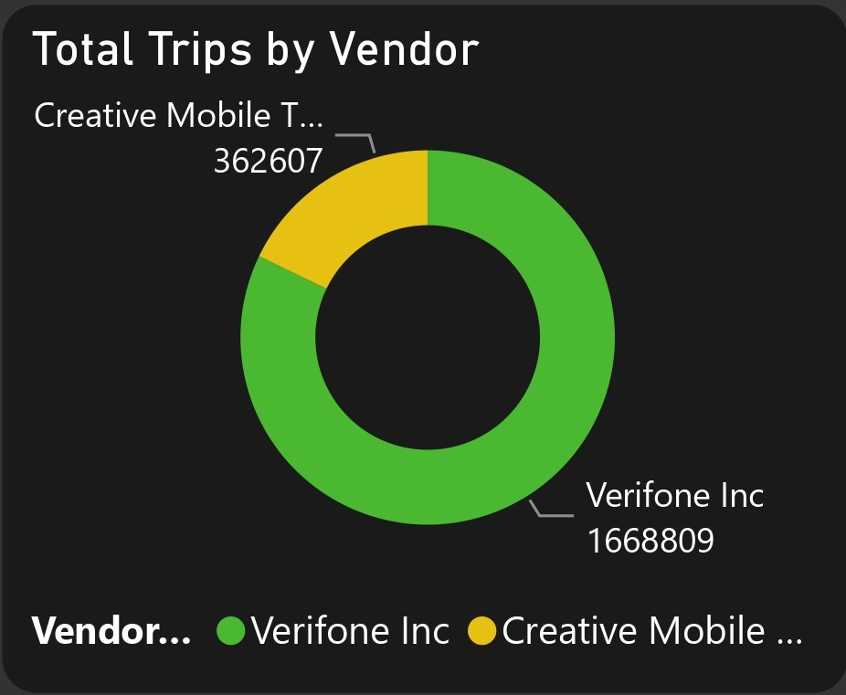

# New York City Taxi Trips (2017-2018) Analysis

 

## Table of Contents
- [Project Overview](#project-overview)
- [Dataset Overview](#dataset-overview)
- [Tools Used](#tools-used)
- [Visualization in Power BI](#visualization-in-power-bi)
- [Project Analysis](#project-analysis)
- [Visuals in Power BI Report](#visuals-in-power-bi-report)
- [Recommendations For Enhancing New York City Taxi Service](#recommendations-for-enhancing-new-york-city-taxi-service)
 

## Project Overview

### Introduction:
The "New York Taxi Trips (2017-2018) Analysis" project aims to explore and analyze taxi trip data from New York City spanning the years (Jan) 2017 and (April 28 - June 8) 2018. New York City's taxi services are a vital component of its transportation system, and analyzing trip data provides valuable insights into travel patterns, demand trends, and other factors influencing transportation dynamics within the city.

For this project, you’ll be playing the role of a new Data Analyst for the New York City Taxi & Limousine Commission. It's your first week on the job, and you just received the following email from the Lead Dispatcher:

Welcome to the team!

This a Project Analysis and Visualization challenge!

We’ve been collecting trip data for specific months in 2017 and 2018, but without a proper analyst we haven’t been able to put it to good use. That's where you come in!

### Objectives:
This is a challenge!
 
The raw data has some issues, so we'll need to make the following adjustments and assumptions to clean and prep the data:
- Let’s stick to trips that were NOT sent via “store and forward”
- I’m only interested in street-hailed trips paid by card or cash, with a standard rate
- We can remove any trips with dates before 2017 or after 2018, along with any trips with pickups or drop-offs into unknown zones
- Let’s assume any trips with no recorded passengers had 1 passenger
- If a pickup date/time is AFTER the drop-off date/time, let’s swap them
- We can remove trips lasting longer than a day, and any trips which show both a distance and fare amount of 0
- If you notice any records where the fare, taxes, and surcharges are ALL negative, please make them positive
- For any trips that have a fare amount but have a trip distance of 0, calculate the distance this way: (Fare amount - 2.5) / 2.5
- For any trips that have a trip distance but have a fare amount of 0, calculate the fare amount this way: 2.5 + (trip distance x 2.5)

Once the data is cleaned up, I’m hoping you can build me a dashboard to help with weekly planning and logistics. For any given fiscal week, I'd like to be able to use historical data to answer the following questions:

1. What's the average number of trips we can expect this week?
2. What's the average fare per trip we expect to collect?
3. What's the average distance traveled per trip?
4. How do we expect trip volume to change, relative to last week?
5. Which days of the week and times of the day will be busiest?
6. What will likely be the most popular pick-up and drop-off locations?

Generate your own insights to add to this!

And of course i added more questions to the objective:

7. What is the Total Revenue in this analysis?                                                                                                            
8. What is the Taxi Trip Trend and Revenue Trend for (Jan) 2017?                                                                                
9. What is the Taxi Trip Trend and Revenue Trend for (April 28 - June 8) 2018?                                                                               
10. What is the total trips by Vendor?                                                                                                                               
11. What is the total trips by payment type?                                                                                                                 
12. What is the total trips by borough?                                                                                                                          
13. Where are the Top 6 Trips zones?                                                                                                                                
14. What is the number of trips by the days of the week?                                                                                        
15. What is the number of trips by the time of the day?   

I realize this is a lot to ask for, but this type of analysis will have a huge impact on our business!
Thanks in advance,

For this challenge, your task is to build a dashboard that meets the requirements.

### Expected Outcomes: 
- __Average Number of Trips:__ By cleaning and preprocessing the data according to the specified criteria, i will provide an accurate estimate of the average number of taxi trips expected for each fiscal week. 
- __Average Fare per Trip:__ Adjusting fare amounts based on provided rules and filtering for street-hailed trips paid by card or cash, i will calculate the average fare per trip. 
- __Average Distance Traveled per Trip:__ Through data cleaning and adjustment of trip distance based on specified rules, i will compute the average distance traveled per trip.
- __Expected Trip Volume Change Relative to Last Week:__ Leveraging historical data, statistical analysis, and trend forecasting techniques, i will predict the expected change in trip volume relative to the previous week. 
- __Busiest Days and Times of the Week:__ Utilizing historical trip data, i will identify patterns to determine the busiest days and times of the week for taxi services. 
- __Most Popular Pick-up and Drop-off Locations:__ Employing a deep analysis techniques on cleaned data, i will identify the most popular pick-up and drop-off locations during each fiscal week. 
- __Total Revenue Analysis:__ Summing up the fare amounts for all trips within the analyzed period to calculate the total revenue generated from taxi services. 
- __Taxi Trip and Revenue Trends for (Jan) 2017:__ Analyzing trip volume and revenue trends over the course of (Jan) 2017 to identify patterns, seasonality, and growth trends. 
- __Taxi Trip and Revenue Trends for (April 28- June 8) 2018:__ Similar to the analysis for 2017, examining trip volume and revenue trends for between April 28 to June 8, 2018 to identify any shifts or changes in demand patterns. 
- __Total Trips by Vendor:__ I will aggregate trip counts based on the vendor or taxi company to assess their respective market share and performance. 
- __Total Trips by Payment Type:__ I will categorize trip counts based on payment methods such as cash or card to understand customer preferences and payment trends. 
- __Total Trips by Borough:__ I will Segment trip counts based on boroughs or geographic regions to identify areas of high demand and distribution patterns. 
- __Top 6 Trip Zones:__ I will Identify the top six zones with the highest trip volumes to prioritize service coverage and marketing efforts. 
- __Number of Trips by Day of the Week:__ I will analyze trip counts by day of the week to identify trends and fluctuations in demand throughout the week. 
- __Number of Trips by Time of the Day:__ I will segment trip counts by time intervals throughout the day to understand peak hours and periods of high demand. 
 
 

### Dataset Overview
This dataset contains 6 tables in csv format, along with a geospatial map in TopoJSON and Shapefile formats
- The 2 Taxi Trips tables contain a total of 2,095,552 million Green Taxi trips in New York City for (Jan) 2017 and (April 28 - June 8) 2018. Each record represents one trip, with fields containing details about the pick-up/drop-off times and locations, distances, fares, passengers, and more.
-  The 454 Calendar table contains a fiscal calendar (2017-2020) used by the Taxi & Limousine Commission, with fields containing the date and fiscal year, quarter, month, 
and week.
- The Taxi Zones table contains information about 265 zone locations in New York City, including the location id, borough, and service zone.
- The Taxi Zones Map files contain a map of New York City with divisions for the 265 locations that can be used to create custom map visuals in Power BI (TopoJSON) or 
Tableau (Shapefile).

This dataset was provided by [Quantum Analytics](https://www.quantumanalyticsco.org/). The 2 key tables that contains the taxi trips data are the 2017_taxi_trips.csv and 2018_taxi_trips.csv. Both contains same number columns and column names. With both table sizes over 200mb, it was too large to upload to github.

Below is a table that displays the data_dictionary which explains the column headers in the taxi trips data 2017 and 2018, explains the taxi_zones, and also expalins the 454_calender table fields for a better understanding of this dataset:

| Table                    | Field                    | Description                            |            
|:------------------------ |:------------------------ |:-------------------------------------- |
|data_dictionary           |VendorID                  |A code indicating the LPEP provider that provided the record (1= Creative Mobile Technologies, LLC; 2= Verifone Inc.)|
|                          |lpep_pickup_datetime      |The date and time when the meter was engaged          |
|                          |lpep_dropoff_datetim      |The date and time when the meter was disengaged        |
|                          |store_and_fwd_flag        |This flag indicates whether the trip record was held in vehicle memory before sending to the vendor, aka “store and forward,” because the vehicle did not have a connection to the server (Y= store and forward trip; N= not a store and forward trip)       |
|                          |RatecodeID                |The final rate code in effect at the end of the trip (1= Standard rate; 2= JFK; 3= Newark; 4= Nassau or Westchester; 5= Negotiated fare; 6= Group ride)       |
|                          |PULocationID              |TLC Taxi Zone in which the taximeter was engaged        |
|                          |DOLocationID              |TLC Taxi Zone in which the taximeter was disengaged       |
|                          |passenger_count           |The number of passengers in the vehicle (this is a driver entered value) |
|                          |trip_distance             |The elapsed trip distance in miles reported by the taximeter |
|                          |fare_amount               |The time-and-distance fare calculated by the meter |
|                          |extra                     |Miscellaneous extras and surcharges (this only includes the $0.50 and $1 rush hour and overnight charges) |
|                          |mta_tax                   |$0.50 MTA tax that is automatically triggered based on the metered rate in use |
|                          |tip_amount                |Tip amount (automatically populated for credit card tips - cash tips are not included)   |
|                          |tolls_amount              |Total amount of all tolls paid in trip           |
|                          |improvement_surcharge     |$0.30 improvement surcharge assessed on hailed trips at the flag drop    |
|                          |total_amount              |The total amount charged to passengers (does not include cash tips) |
|                          |payment_type              |A numeric code signifying how the passenger paid for the trip (1= Credit card; 2= Cash; 3= No charge; 4= Dispute; 5= Unknown; 6= Voided trip) |
|                          |trip_type                 |A code indicating whether the trip was a street-hail or a dispatch that is automatically assigned based on the metered rate in use but can be altered by the driver (1= Street-hail; 2= Dispatch) |
|                          |congestion_surcharge      |Congestion surcharge for trips that start, end or pass through the congestion zone in Manhattan, south of 96th street ($2.50 for non-shared trips in Yellow Taxis; $2.75 for non-shared trips in Green Taxis) |
|taxi_zones                |LocationID               |Unique identifier assigned to each specific location within the service zone       |
|                          |Borough                  |The borough (administrative division) of New York City where the location is situated   |
|                          |Zone                     |A specific geographical zone or area within the borough.    |
|                          |service_zone             |Denotes the service zone classification of the location, indicating whether it falls within New York City's defined service zones for taxi operations.    |
|454_calender              |Date                     |The calendar date of the recorded data entry  |
|                          |FiscalYear               |The fiscal year in which the date falls, typically representing the financial reporting year of the organization |
|                          |FiscalQuarter            |The fiscal quarter of the year in which the date falls|
|                          |FiscalMonthNumber        |The numerical representation of the fiscal month within the fiscal year|
|                          |FiscalMonthOfQuarter     |The ordinal representation of the fiscal month within the fiscal quarter|
|                          |FiscalWeekOfYear         |The week number within the fiscal year|
|                          |DayOfWeek                |The day of the week corresponding to the date (e.g., Monday, Tuesday, etc.)|
|                          |FiscalMonthName          |The name of the fiscal month (e.g., January, February, etc.)|
|                          |FiscalMonthYear          |The combination of the fiscal month and year|
|                          |FiscalQuarterYear        |The combination of the fiscal quarter and year|
|                          |DayOfMonthNumber         |The numerical representation of the day within the month|
|                          |DayName                  |The name of the day corresponding to the date (e.g., Monday, Tuesday, etc.)|
 

### Skills Utilized
1. Data Cleaning
2. Data Modelling
3. Data Visualiziation
4. Descriptive Analytics
5. Analytical and Critical Thinking
6. Problem Solving
7. Communication and Reporting
 

### Tools Used
1. Power Query Editor
    - Was used to:
        1. Clean
        2. Transform the datasets for this analysis.
           
2. Power BI (Was used to create reports and dashboard for this analysis)
    - The following Power BI Features were incorporated:
        1. DAX
        2. Quick Measures
        3. Page Navigation
        4. Filters
        5. Tooltips
        6. Button
 

### Data Cleaning, Transformation and Loading using the Power Query Editor:
1. Changed the columns data types in both the 2017_taxi_trips.csv table and the 2018_taxi_trips.csv to the right data types.
2. Sticked to the taxi trips that were not sent via __store and forward__ by removing all rows that has the value __"Y"__ in the data table rows of the __"store_and_fwd_flag"__ column in both the 2017 and 2018 tables.
3. Sticked only to the street-hailed trips paid for by __card__ or __cash__ with a standard rate by removing rows that doesn't have the text value __"card"__ or __"cash"__ in the __"payment_type_details"__ column of both tables.
4. Removed all trips with dates before __2017__ or after __2018__, along with any trips with pickup or drop-offs into unknown zones by removing rows of data from both tables that the __"ipep_pickup_datetime"__ and __"ipep_dropoff_datetime"__ does not fall into the year __2017__ and __2018__. Secondly, removed rows from both table where the __"PULocationID"__ and __"DOLocationID"__ columns have the values __264__ or __265__ which indicates unknown zones.
5. Assigned __1__ passenger to the __"passenger_count"__ column of both tables where the passsenger count row has null values or __0__.
6. Swapped all __"ipep_pickup_datetime"__ and __"ipep_dropoff_datetime"__ columns where a __pickup date/time__ is after the __drop-off date/time__.
7. Removed rows from both table where the __"fare_amount"__ column data equals __0__ and the __"trip_distance"__ column has values in its rows that is greater than __24.00__ (24 hours of the day).
8. Transfomed the negative values in the __"extra"__, __"mta_tax"__, __"tip_amount"__, __"tolls_amount"__, and __"improvement_surcharge"__ of the 2 tables to positive values by multiplying the negative values with __"-1"__ which then returns them as positive values.
9. Recalculated rows in both tables with a __"trip_distance"__ of __0__, but has a positive value in the __"fare_amount"__ column by using the formula: __("fare_amount" - 2.5) / 2.5__.
10. Recalculated rows in both table with a __"fare_amount"__ of __0__, but with a positive value in the __"trip_distance"__ column by using the formula: __2.5 + ("trip_distance" x 2.5)__.
11. Added a custom column __"trips_month"__ in both tables which was extracted from the month in the __"Ipep_drop_off_datetime"__ column to display months as actual month names: __(January - December)__ using the "If function" which will help us identify trip months trend for the benefit of this analysis.
12. Added a custom column __"trip_days"__ in both tables which was extracted from the day in the __"Ipep_drop_off_datetime"__ column to display the days of the week: __(Sunday - Saturday)__ using the "If function" to help us identify trip days trend for the benefit of this analysis.
13. Added a custom column __"trip_time_of_day"__ in both tables which also extracts the time of the day from the __"Ipep_drop__off_datetime"__ and then converts it to particular periods of the day: __(Early Morning, Morning, Afrternoon, Evening, Night)__ using the "If function" to help us idnetify particular period of the day for pickups and drop-offs.
14. Added a custom column __"Vendor_Name"__ in both tables which extracts the vendor code from the __"VendorID"__ column and then transforms it to the actual name of the vendor by using the "If function" which will help us identify the actual Vendors of these taxis.
15. Added a custom column __"payment_details"__ in both tables which also extracts the payment type code from the __"payment_type"__ column and converts it to the actual payment type using the "If function" which will help us identify actual payment types used in paying for taxi fares.
16. Made sure no columns in both tables have null value cells an that all columns report a column quality of __100%__ valid.
17. Reordered all columns in both tables appropriately.
18. After cleaning and transforming these tables, the data rows of the 2017_taxi_trips.csv dropped from __1,048,574__ rows to __1,013,190__ rows, while the 2018_taxi_trips.csv data rows dropped from __1,046,977__ rows to __1,018,226__ rows of data.
19. Merged both tables into a single table.
20. Added a new column __"Trips_ID"__ which indexed all the trips merged from __1__ to __2,031,416 million__.
 
 

## Data Model Design
The data required for this analysis are located in 2 tables. Therefore, data modelling is required. A star Schema is designed with the __2017_taxi_trips_cleaned__ (merged) table representing the fact table containing quantitative measures and details, and to which the __taxi_zones__ dimension table is modelled or connected to, using the __DOLocationID__  and __LocationID__ fields in both tables. 

- The Model View displays a view of the __2017_taxi_trips_cleaned__ (fact) table, the __taxi_zones__ (dimension) table, and the __Data Analysis Expression__ (DAX) standing alone.

**Power Query Editor View**

Cleaned Data Power Query Editor Screenshot                                         |                                
:---------------------------------------------------------------------------------:|
                              |        
 

**Model View Screenshot**

Model View                                                                        |                                
:--------------------------------------------------------------------------------:|
                                             |        
 
 

## Visualization in Power BI:
#### Report View 1
_Dashboard1.jpg)

#### Report View 2
_Dashboard2.jpg)
 
 

### Project Analysis:
From the analysis, i made the following Key findings below:
- The Total Number of Trips is __2,031,416.__
- Average Distance Per Trip is __2.88min.__
- The Total Number of Passengers is __2,776,908.__
- Average Trips Per Day is __27,828.__
- Total Number of Trip Zones is __265.__
- Average Fare Per Trip is __$12.__
- Total Revenue is __$29.83M.__
 
 

- 

- **Taxi Trips Trend and Revenue Trend In (Jan) 2017:**
- The following insight can be drawn from this analysis of taxi trips trend and revenue trend for January 2017.
   - __Monthly Trend:__ In January 2017, there is clearly a swing from a low of 9,496 on 31 January to 42,781 on 28 January. If there is a general trend, it seems that the number of trips is higher during weekends as compared to weekdays. There are specific peaks occurring on weekends like 14, 21, and 28 January.
   - __Revenue Trend:__ The total revenue generated also varies throughout the month, in correspondence with the trip volumes. Peaks in revenues match higher volumes of trips, indicating that revenues are positively correlated with the number of taxi trips.
   - __Peak Periods:__ Weekends show a considerably higher volume of trips and revenue compared with weekdays. That might mean that the demand for taxis is higher in weekends, maybe due to leisure activities, events, or tourism. The first weekend, January 7th–8th, surged forward both in trip volume and revenue—a very good indication of how the month will turn out.
   - __Mid-Month Surge__ : There is an observable surge in the volume and revenue of trips during the middle of the month; January 14th reflected both the highest number of trips and revenues for the entire month. It could relate to events, holidays, or special occasions.
   - __End of Month Decline__: There is a downward trend in both the number of trips and revenue towards the end of the month, with January 31st being the lowest. This may be influenced by reduced consumer spending post-holiday season or by certain events affecting travel patterns.
   - __Implications for Planning:__ The case study of trends in trip volumes and revenue for January 2017 would therefore turn out to be immense help in operational planning and resource allocation by taxi services in the subsequent months.
 
 

- 

- **Taxi Trips Trend and Revenue Trend In (April 28- June 8) 2018:**
- This analysis of taxi trips trends and revenue trends from April 28 to June 8, 2017 draws the following insight. 
- __Overall Trends:__ From April 28 to June 8, 2018, there were fluctuations in terms of the total number of trips by taxis, along with the total amount generated, thereby showing changes in demand and economic factors over time.
- __Weekend Peaks:__ Year by year, weekends show larger volumes and revenues of trips against other weekdays. This clearly reflects the evident role of leisure travel and other recreational activities in the overall demand for taxi services during weekends.
- __Holiday Impact:__ This is a fact: prominent peaks of trips volume and revenue were observed during holidays or long weekends like Memorial Day weekend (May 26th-28th) and June 1st.
- __Mid-Week Trends:__ While generally treated as days with lower ride volumes compared to weekends, some weekdays—specifically Thursdays and Fridays—have the largest number of rides taken and revenue, likely due to commuting, social events, and nightlife.
- __Trends in the End-of-Month Period:__ From May 31st through June 8th, there is a gradual decline in the number of trips and revenue, which may indicate a real shift or change at the latter end of the month in travel patterns or economic conditions.
- __Economic Indicators:__ Other broader factors that may result in changes in trip volumes and revenues are consumer spending trends, employment levels, and tourist activity that impacts demands for transport services.
- __Operational Considerations:__ An appreciation of the trends and patterns in taxi trips and their revenues during that time period will guide operational decisions on fleet management, manning, pricing strategies, and promotion campaigns by taxi operators.
- __Revenue Forecasting:__ Developing forecasting models against historical trips and their trends in revenues could provide taxi operators with the projection of their future streams. That would, therefore, help them plan and provide for their resources accordingly.
- __Customer Behavioural Insights:__ Analysing volumes of journeys and patterns of revenues may indicate something about customer behaviours, preferences, or travel habits, and hence guide relevant service improvements and marketing strategies to better answer customer needs and expectations.
 
 

- 

- **Total Trips By Vendor:**
- On this analysis of Total Trips By Vendors, I developed the following insight:
– __Verifone Inc dominance:__ Verifone Inc is the most preeminent company in the taxi industry, having enormously higher total rides compared to Creative Mobile Technologies. Its total rides taken, amounting to 1,668,809, add up to approximately 82.15% of the total market share, thus mirrors to be a strong presence and high diffusion of Verifone services across the industry.
- __Market Share Gap:__ Verifone Inc. took a maximum number of trips compared to Creative Mobile Technologies, which extends to mean a gap in market share between the two companies. Without a doubt, the dominance of Verifone Inc. in the taxi business at more than 95% definitely calls for factors such as brand recognition, service reliability, and market penetration, among others, that would give it a greater customer base with higher trip volumes compared to its closest competitor.
- __Competitive Landscape:__ Though a fraction of the market share, Creative Mobile Technologies still comes in second with a total of 362,607 trips. Its percentage of the market share is 17.85%, considerably lower than that of Verifone Inc. Still, Creative Mobile Technologies is a force the first company has to contend with as it services a niche segment or specific customer base.
- __Customer Preference and Satisfaction:__ The higher number of trips attributed to Verifone Inc. can be interpreted to mean, at a general level, a greater preference and higher customer satisfaction rate than its counterpart, thereby reflecting positively on parameters such as service reliability, convenience, and customer experience.
 
 

- 

- **Total Trips By Payment Type:**
- Listed below are the insights I derived for the Total Trips By Payment Type:
- __Preference of Credit Card Payments:__ The data analysis shows that the most preferred method of payment for trips taken in taxis is by credit card payment, totaling 1,092,527. The predominance of credit cards in making payments for travel in taxis is more predisposed to a growing trend toward cashless transactions, precipitated by factors such as convenience, security, and rewards by credit card companies.
- __Importance of Cash Payment:__ Even though the volume of credit card payment was enormous, cash payments still had a fair share of the market with 938,889 rides. Customer preference and ease of access, along with comfort in using cash payments for those customers who either do not have a credit card or just prefer cash to manage their expenses, keeps this source of payment relevant.
- __Diverse Payment Preferences:__ Coexistence of credit-card and cash payments; diverse preferences and needs of passengers of taxis who may prefer their mode of payment based on aspects such as personal financial habits, access to banking services, and convenience.
 
 

- 

- **Total Trips By Borough:**
- In the Total Trips by Borough, some of the insights that I came up with were as follows:
- Manhattan was the borough with the highest number of taxi trips, with 747,461. The result for Manhattan does not come as a surprise as it is the leading commercial, financial, and tourist district of New York City. This high volume of taxi trips in Manhattan simply reflects the high activities and density within the borough with a high demand for transportation services.
- Brooklyn and Queens are the next closest to Manhattan, with 586,543 and 578,673 trips, respectively. These boroughs have large populations and significant economic activity as well, which would help explain their relatively high volumes of taxicab trips. Probably the varied kinds of neighborhoods and attractions in Brooklyn and Queens drive demand for taxis, as well as residential areas and commercial centers that incorporate them.
- The Bronx is the borough with the least number of taxi trips: 118,046. Compared to the other boroughs—Manhattan, Brooklyn, and Queens—Bronx perhaps has fewer attractions and commercial districts, but nonetheless, it remains a very important market for taxi services to its residents and visitors.
- The lowest in taxi trips are Staten Island and EWR with 585 and 108 trips respectively. It is assumed that Staten Island has fewer taxi rides probably because of its lower population density and little transport, which leads to less traffic circulation within the borough. The low number of taxi trips from EWR is expected since it is primarily an airport; its taxi services are mainly targeted at arriving/departing travelers.
 
 

- 

- **Top 6 Trips Zones:**
- Here is a a detailed analysis for the top 6 trip zones:
- __East Harlem North Dominance:__ East Harlem North is the leading trips zone, with 69,116 trips; thus, it is a high-volume taxi demand area. Probably, residential density and business activities drive demand in that zone, along with their accessibility to transportation.
- __Central Harlem North Close Second:__ Central Harlem North follows with 67,322 trips to East Harlem North, almost as high a demand for the service. In the case of Central Harlem North, its proximity to cultural attractions, dining options, and key transportation hubs would have driven this zone's volume of trips to a high amount.
- __Astoria performed well:__ Astoria placed third of the top trip zones, with 63,712 trips amounting to a huge demand in taxi rides for this neighborhood. Astoria hosts people of all walks of life, has a 'lively' night scene, and is a stone's throw away from main transportation hubs—a set of features that should make it a big taxi destination.
- __Central Harlem and Jackson Heights Appeal:__ The runners-up are Central Harlem and Jackson Heights that account for 60,523 and 56,728 trips respectively. The cossetting neighborhoods are culturally diverse composed of residential communities and have commercial activity that appeals both to the residents and visitors who move around using taxi services.
- __The Middle-of-the-Pack Performance of Park Slope:__ Finally, to round out the top 6 trip zones, it had 49,809 trips, showing a slightly lower volume compared with those zones ranking above. The premium of living in Park Slope—trendy shops, restaurants, and beautiful parks—has meant that the already steady demand for taxi rides is likely to be further driven up.
 
 

- 

- **Trips By Days of The Week:**
- Below is an analysis of trips by days of the week:
- __Weekend Dominance:__ Sunday tops the list of the highest number of taxi trips with an average of 313,636, very closely followed by Fridays with 311,629 mean trips, and Saturdays with 297,812 mean trips. This distinctly shows the tendency for more travels and transport needs over the weekends, probably for recreation, leisure travel, and social outings.
Thursday, in relative comparison, ranks fourth, with 286,450; Tuesday, third, with 276,393; Monday, fourth, with 274,772 trips; and Wednesday, fifth, with 270,724 trips. This would then suggest that, as compared to weekends, weekdays generally hold steady but somewhat inferior demands for taxi rides due to a variety of variables such as commuting, work-related travel, and running errands.
- __Customer Behavior Insights:__ Increasing weekend demand may indicate changing consumer behavior and lifestyle preferences. That is to say, increasing use of taxis for convenience and flexibility for social activities, events, and outings.
- __Traffic and Events Influence:__ Other factors that may influence daily trip volumes include traffic, special events, and cultural activities. For example, high traffic on weekdays could alter the duration and availability of trips, while large events or festivals taking place at weekends could increase the demand for taxi services in certain areas.
Operational Considerations: With information about which days of the week trips occur, taxi operators can spread out their drivers more efficiently and adjust pricing strategies such that there is balance in periods of surge demand.
 
 

- 

- **Trips By Time of The Day:**
- This analysis does provide a clear look at the volume of trips undertaken by taxis based on the time of day and provides a few wonderful insights that might be found here:
- __Nighttime Dominance:__ Nighttime surfaces as the day's time most of the taxi trips created at 536,556 trips. This could be an indication that during these hours set in time for the nighttime, there would be high demand for taxi services as a result of existing multiple activities that relate to nightlife, several social events and late-night commuting.
- __Morning Rush:__ It is immediately after the Evening Rush, with the second-highest volume for the time specified, standing at 442,310, thus immense demand for taxi services at the period stands out. Commuters, workers, and students must, therefore, rely on taxis as a means of movement to work, school, and other day-time destinations during this peak period.
- __Evening Activity:__ The evening, at 401,717 trips, comes closest to this total, thus showing further strong demand for taxi services in the evening. This time will incorporate a number of activities, such as dining out or entertainment, combined with leisure travel to account for this steady stream of taxi trips.
- __Afternoon Lull:__ In comparison to the time frames of morning and evening, there are slightly less trips in afternoon travel – 392,141 trips. This tends to indicate as a lull in taxi demand, given that during the day, most people will be at work, running errands, or engaged in other activities, which means they need to travel less.
- __Side note:__ Early Morning Use The time rack for early morning had the lowest volume, at 258,692 trips. This is surely no small figure; however, the ease of the early morning hours could imply that this possibly is a somewhat quieter time when much less travelers and other commuters require a taxi.
- __Operational Considerations:__ Taxi operators can use insights into trips by time of day to build out driver schedules, fleet deployment, and pricing strategies against fluctuating demand patterns across times of the day.
-  
 

- 

- **Most Popular Pickup and Drop-oof Boroughs:**
- This analysis depicts the top 3 most popular boroughs by the quantity of daily taxi trips as panned out below:
- __Manhattan Tops:__ The whole of 747,461 trips was observed as the maximum picked-up and dropped-off area in Manhattan. There could not be any more evident reason because Manhattan is really a core of business, cultural, and tourist activities in the City of New York. High, though relatively small, population; iconic structures; and elaborate transportation highly drive the demand for taxi service in the borough.
- __The Role of Brooklyn:__ Following Manhattan with 586,543 trips, the current study showed that Brooklyn was also crucial as a source and destination for Federal taxi trips. Its culturally rich and large, with distinct neighborhoods, combined with its growing population, can account for its importance as a destination for Federal taxi trips. Therefore, when we consider that Brooklyn is close to Manhattan and a hub for residency, the demand of transportation to Brooklyn is further higher.
- __High Demand in Queens:__ Queens was ranked the third most popular location for both pickups and drop-offs, attracting 578,673 trips. One of the largest boroughs in New York City, Queens is a mix of residential, commercial centers, and many cultural attractions. This elasticity will, in turn, contribute to creating constant demand for taxi services within this borough because of its diverse population and economic activity.
 
 

- 

- **Average Number of Trips By Day Trend:**
Average Number of Trips by Day Trend: These views below are portrayed in the trend of the average number of trips per day:
- __Weekend Domination:__ Fridays average 15,581.45 rides per day, which is highest in rides in the database. This tends to indicate that high demand for taxis shifts to the end of the workweek probably due to social activities, nightlife, or just higher traveling.
– __High Sunday and Saturday performance:__ Sunday and Saturday do not fare too far behind Friday at 14,933.05 and 14,890.60 trips on average respectively. Evidently, all this huge demand for taxi services during the weekend represents leisure travel, recreational outings, and other activities meant for unwinding that residents and visitors usually undertake.
- __Midweek Variations:__ While weekends generally held rather relatively higher average daily volumes as opposed to weekdays, rather significant day-of-the-week variations were at play across weekdays. Thursday placed fourth with 14,322.50, followed by Tuesday, which averaged 12,563.32 trips, Wednesday at 12,305.64 trips, and finally, Monday at 11,946.61 on average.
- __Service Planning Implications:__ This will hence enable taxi operators to change levels of service, generate optimum driver schedules, and resource against patterns of demand that vary throughout the week. Adjustments like this bring periods of service provision closer to peaks in demand and therefore improve service quality and operational efficiency.
 
 

- 

- **Busiest Time and Days of The Week Trend:**
This is a trend analysis of the busiest time and day of the week, and here are the insights I could develop:
- Weekend Evenings Dominate: The most interior taxi trip times are weekend evenings. Sunday night and Saturday night top the list with 60,288 and 57,064 taxi trips, respectively. This corresponds to the prototypical patterns of leisure and socialising; one major way people typically spend their weekend evenings is living it up at nightspots, going out for dinner, and having fun.
- Early Morning Surge on Weekends—Waking up early on weekends, in particular on Sundays, surge is high in taxi trips at 86,590. This would correspond most likely to an earlier travel time for activities such as airport drop-offs, weekend getaways, or shifts at work, underpinning the importance of taxi service even at off-hours.
- Friday Mornings and Nights: Taxicabs also run in large numbers on Friday mornings and nights. For instance, there are over 70,057 trips in the morning and 93,157 at night. The morning rush hour explains the fact that this time marks the commencement of people's journeys to their places of work or even highlights the onset of weekend travel, while the evening mostly describes people's beginning of weekend celebrations.
- Weekday Evenings Show a Strong Steady Demand: Thursday, followed by Wednesday night, are days of the week when demand for taxi services is still strong with 59,775 and 56,586 trips, respectively. It would likely be an indication that there is a perpetual market for taxis to take people beyond work or evening hour activities in the middle of a workweek.
- Afternoon Trends for the Week: One could find relative stability in the demand of taxi services in the afternoons over the week. To be more specific, Sunday afternoon has the highest number of trips with 60,288, indicating that due to various activities people engage in during the day, they tend to use taxis not only during the weekdays but during the whole week.
 
 

## Visuals in Power BI Report:
You can view and interact with this dashboard report on New York City Taxi Trips (2017-2018) Analysis [here](https://app.powerbi.com/view?r=eyJrIjoiM2FiNTRkNWItNDYxNC00NjUwLWE2NzAtOTVlZTAyM2QyN2UyIiwidCI6IjdlYzI5NjU5LTNjZjItNGYzZi1hYmIzLWE3MjJlZGY3ZmYyZCJ9).
 
 
 

## Recommendations For Enhancing New York City Taxi Service:
- __Service Quality Improvement:__ Set up a rigid system of training that taxi drivers undergo to become more professional, having very well-developed customer service skills, whereby knowledge of the routes in a city is greatly enhanced. Drivers are incentivized to keep their cars clean and serviced to ensure comfort and security during road journeys.
- __Integrated technology:__ The latest booking and dispatch systems, mobile applications, and GPS navigation tools may facilitate taxi bookings and hence help reduce waiting time, generally improving service efficiency.
- __Dynamic Pricing Strategies:__ Implement dynamic pricing models about demand and supply dynamics, traffic condition, and the time of the day after adjustments in view to adjust the fare price. This offers discounts, promotions, and loyalty schemes that would encourage repeated usage and draw new customers during off-peak hours.
- __Extension of Service:__ Service extension to unserved and underserved areas, suburban neighborhoods, and other improved transportation nodes, including airports, rail stations, and major attraction centers.
- __Enviromental Friendly Vehicles:__ Introduce environmentally friendly vehicle options, for example, electric or hybrid taxis, that have less impact on the environment and are key to hitting sustainability goals.
- __Enhance Safety and Security:__ develop a much more solid system of safety practices and security policies to protect the interests of the passengers and drivers even further.
- __Community Outreach:__ build good rapport within local communities through effective engagement in community activities, through the sponsorship of neighbourhood events, and in philanthropic giving.
- __Transparency and Accountability:__ Design and clearly communicate to passengers transparent policies on pricing, fares, and service levels in a manner that will engender passenger confidence in the service.
- __Stakeholder Engagement:__ Collaborate with local authorities and transport/industry partners in eliminating the regulatory impediments that are strangulating the taxi industry, in simplifying licensing, and in fast-tracking innovation.
 
 

## Thank You For Following Through!

